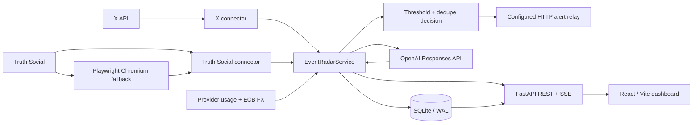

# Event Radar

Local-first event monitoring, AI classification, and high-signal alerting for selected public social sources.

[](https://www.python.org/)
[](https://fastapi.tiangolo.com/)
[](https://react.dev/)
[](LICENSE)

Event Radar is a single-process FastAPI service that ingests posts from configured X and Truth Social accounts, normalizes and persists them, classifies new events with the OpenAI Responses API, applies threshold and duplicate-suppression policy, and records or relays high-signal alerts. A React/Vite dashboard provides local event triage, account controls, activity, latency, feedback, and cost/usage views.

The project is designed for a local operator environment. It ships no production credentials, cookies, chat IDs, private hosts, or machine-specific deployment paths.

## Core capabilities

- Official X API connector with filtered-stream behavior, catch-up polling, and rate-limit backoff.
- Truth Social authenticated polling with a Playwright/Chromium browser fallback when direct requests are blocked.
- OpenAI structured-output classification and local aggregation of the model's scoring rubric.
- Explicit classification-failure handling; the current implementation does not invent a heuristic market-moving score when OpenAI is unavailable.
- SQLite persistence for source payloads, normalized events, analyses, alerts, activity, checkpoints, latency, feedback, and usage/accounting state.
- Thresholding and duplicate suppression before delivery.
- HTTP relay integration for downstream Telegram delivery; Event Radar itself does not call the Telegram Bot API directly.
- FastAPI REST/SSE interface and a bundled React/Vite operator dashboard.
- Database-scoped single-instance lock for the local deployment model.

## 🔒 Security model

Event Radar binds to `127.0.0.1:8089` by default. The FastAPI routes do **not** provide built-in user authentication or authorization, so loopback binding is a material part of the intended security posture.

Do not expose the service directly to an untrusted LAN or the public Internet. Remote deployments need an independently configured TLS/authentication/access-control layer. Keep API keys, Truth Social cookies, relay credentials, databases, logs, Playwright state, and real environment files outside Git.

See [SECURITY.md](SECURITY.md) for the security policy and trust boundaries.

## 🚀 Getting started

Requirements and exact setup details are documented separately because the repository does not contain enough evidence to publish invented hardware minima or an exact tested machine specification.

1. Read [docs/REQUIREMENTS.md](docs/REQUIREMENTS.md).
2. Follow [docs/SETUP.md](docs/SETUP.md).
3. Copy `config/env.example` to the ignored `config/env.sh` and add only your own credentials/configuration.
4. Keep `EVENT_RADAR_ALERT_DRY_RUN='true'` while validating the installation.
5. Build the frontend and start the service.

Typical development setup:

```bash
python3 -m venv .venv
. .venv/bin/activate
python -m pip install -e '.[dev]'

cd frontend
npm ci
npx playwright install
npm run build
cd ..

event-radar
```

Then open `http://127.0.0.1:8089/`.

Native Windows users can run `launch_event_radar.bat` after the frontend has been built. Linux/WSL users can also use `scripts/start_event_radar.sh`.

## 🧩 Architecture



For trust boundaries, data flow, component responsibilities, and deployment constraints, see [docs/ARCHITECTURE.md](docs/ARCHITECTURE.md) and the [high-resolution architecture infographic](docs/architecture.svg).

## Configuration

`event_radar/config.py` reads process environment variables and an optional shell-style environment file. The public-ready default environment file is project-local `config/env.sh`; override it with `EVENT_RADAR_ENV_FILE` when needed.

Important configuration groups:

- `EVENT_RADAR_OPENAI_*` — classification and optional billing visibility.
- `EVENT_RADAR_X_*` — X API access and connector behavior.
- `EVENT_RADAR_TRUTH_SOCIAL_*` — authenticated Truth Social collection.
- `EVENT_RADAR_TELEGRAM_RELAY_*` — downstream HTTP relay configuration.
- `EVENT_RADAR_APP_*`, `EVENT_RADAR_DATABASE_PATH`, `EVENT_RADAR_ALERT_*` — local service/runtime policy.

Use `config/env.example` as the reference. Do not put real values in documentation or committed configuration.

## API

FastAPI exposes health, event, account, connector, activity, latency, dashboard, overview, and SSE routes. Generated documentation is available at `/docs` and the OpenAPI document at `/openapi.json` on a running instance.

See [docs/API.md](docs/API.md) for the route overview and security warning.

## Verification

Backend tests:

```bash
pytest
```

Frontend checks:

```bash
cd frontend
npm test
npm run lint
npm run build
npm run e2e
npm audit --omit=dev
```

Playwright browser coverage requires the corresponding browser binaries.

## Documentation

| Document | Purpose |
| --- | --- |
| [Setup](docs/SETUP.md) | End-to-end installation, configuration, validation, and upgrade steps |
| [Requirements](docs/REQUIREMENTS.md) | Evidence-based hardware/software/network requirements and explicit unknowns |
| [Architecture](docs/ARCHITECTURE.md) | Components, data flow, trust boundaries, Mermaid diagram, scaling constraints |
| [Architecture infographic](docs/architecture.svg) | High-resolution visual system map |
| [API](docs/API.md) | REST/SSE endpoint overview and API security posture |
| [Troubleshooting](docs/TROUBLESHOOTING.md) | Issues actually represented in code/history and their fixes |
| [Security policy](SECURITY.md) | Security model, sensitive state, and vulnerability reporting |
| [Contributing](CONTRIBUTING.md) | Development and pull-request expectations |
| [Public release checklist](docs/PUBLIC_RELEASE_CHECKLIST.md) | Final maintainer gates before any visibility change |

`docs/PROMPTING.md` is intentionally not included: Event Radar does not expose an operator-facing prompt/agent interface. Its classification prompt is an internal implementation detail in the classifier, so publishing copy/paste agent prompts would misrepresent the project.

## Operational notes

- X monitoring requires a valid official bearer token; sustained provider rate limits reduce freshness and trigger connector backoff.
- Truth Social monitoring requires authenticated cookie state; the browser fallback additionally requires the frontend Node/Playwright installation.
- OpenAI classification failures are persisted and surfaced rather than replaced by heuristic scoring.
- Relay delivery is suppressed when relay credentials are absent and can be held in dry-run mode during setup.
- Historical backfill is not alerted by default unless explicitly configured otherwise.
- The default alert threshold is `65`; deployment-specific tuning should be validated against the operator's own false-positive/false-negative tolerance.

## License

Event Radar is **source-available**, not OSI-approved open source. It is licensed under the Apache License 2.0 subject to Commons Clause License Condition v1.0. You may use, modify, and redistribute the software, including internal business use, subject to the combined terms. The Commons Clause restricts selling the software itself or offering a product or service whose value derives entirely or substantially from the software's functionality.

See [LICENSE](LICENSE) and [NOTICE](NOTICE).
