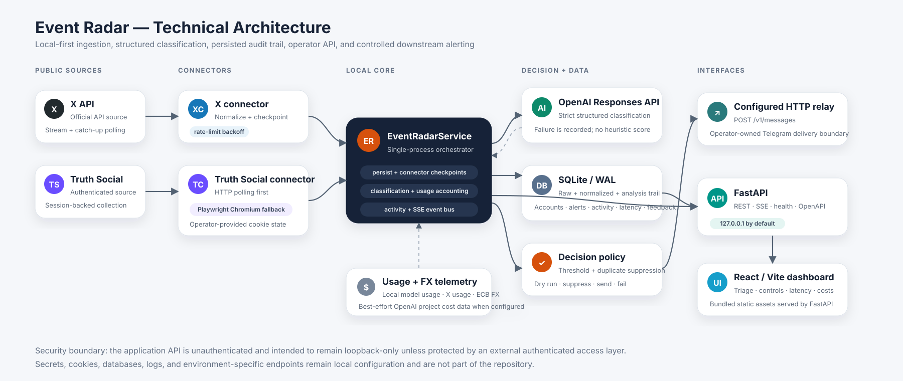
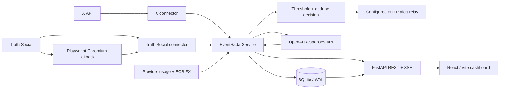

# Architecture

Event Radar is a local-first, single-process monitoring service with asynchronous source connectors, SQLite persistence, OpenAI classification, an HTTP alert relay, and a React operator dashboard.

## Component map

### Source connectors

- **X connector:** uses the official X API, combining filtered-stream behavior with catch-up polling and rate-limit backoff.
- **Truth Social connector:** uses authenticated HTTP polling and can switch to a Node/Playwright Chromium worker when direct API access is blocked. The worker receives requests over its subprocess stdin/stdout protocol and uses operator-provided cookie state.

Both connectors normalize source-specific payloads into the shared `CanonicalPost` model before handing posts to the service layer.

### Service layer

`EventRadarService` owns the repository, event bus, classifier, billing service, relay client, instance lock, and source connectors. On startup it acquires a database-scoped single-instance lock, initializes the SQLite schema, and starts enabled connector tasks.

For a newly observed post, the service:

1. Persists raw/normalized post state and connector checkpoints.
2. Sends the normalized post to the OpenAI-backed classifier.
3. Stores analysis metadata, token usage, market-impact output, score, threshold, and decision when classification succeeds.
4. Applies duplicate-suppression logic and alert-threshold policy.
5. Sends eligible alerts to the configured HTTP relay, or records suppression/dry-run/failure state.
6. Publishes updates to the in-process event bus for the SSE/dashboard path.

If OpenAI classification is unavailable, the service records the classification failure. The current implementation intentionally does not substitute a heuristic market-moving score.

### Persistence

The repository layer uses SQLite through `aiosqlite`. The schema stores tracked accounts, raw posts, normalized posts, analyses, alerts, connector checkpoints, activity, latency stages, feedback, and usage/accounting data. The default database is `var/event_radar.db`.

A single-instance lock prevents two Event Radar processes from intentionally operating against the same deployment database at the same time.

### API and dashboard

FastAPI exposes REST endpoints, an SSE stream, health state, and generated OpenAPI documentation. It also serves the production React/Vite bundle from `event_radar/static/app`.

The dashboard uses the same local API for event triage, detail inspection, account management, manual trigger tests, connector health, activity, latency, feedback, and cost/usage views.

### Alert relay

`TelegramRelayClient` posts alert payloads to an operator-configured HTTP relay at `/v1/messages`. The relay endpoint, API key, and chat identifier are configuration inputs; Event Radar does not embed a production relay address and does not directly call Telegram's public Bot API.

If relay credentials are absent, delivery is suppressed. Dry-run mode can validate the decision path without transmitting an alert.

### Cost and usage data

Billing/usage views combine persisted Event Radar model usage with best-effort provider information. The code can query OpenAI organization/project cost data when an admin key is configured, track X request/usage information, and retrieve ECB FX reference data for currency conversion.

## GitHub-native diagram

## Trust boundaries

1. **Local application boundary.** FastAPI defaults to loopback and has no built-in user authentication. Binding it to a routable interface changes the threat model and requires external access controls.
2. **Credential boundary.** Provider keys, session cookies, relay credentials, and chat identifiers are local configuration and must never be committed.
3. **External API boundary.** Source content and classification inputs leave the local process when the corresponding provider feature is enabled.
4. **Browser boundary.** Truth Social browser fallback executes a Playwright Chromium subprocess with authenticated cookie state; browser logs/traces and cookie stores should be treated as sensitive.
5. **Persistence boundary.** SQLite contains raw source payloads, normalized text, analysis output, activity, and operational metadata. Protect and dispose of it according to the deployment's data policy.

## Deployment shape and scaling limits

The current architecture is deliberately a single local service with SQLite. The repository does not contain a distributed queue, multi-node coordination, external relational database, or horizontally scalable worker tier. Any move to multi-host deployment should redesign locking, persistence, authentication, secrets management, and event delivery rather than assuming the local-first architecture is safe to expose unchanged.
